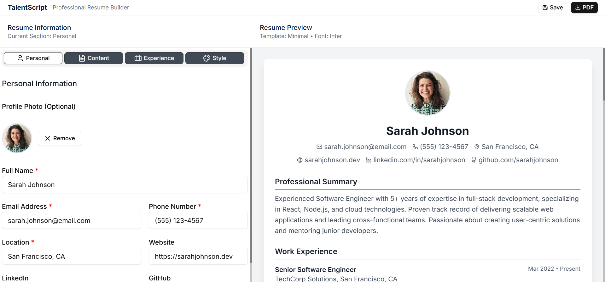
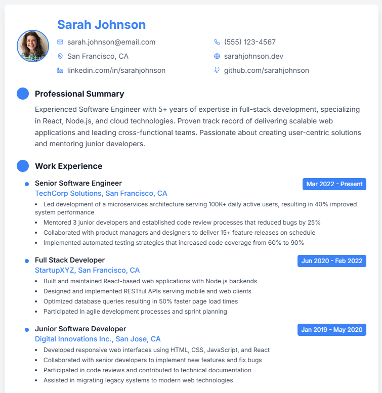
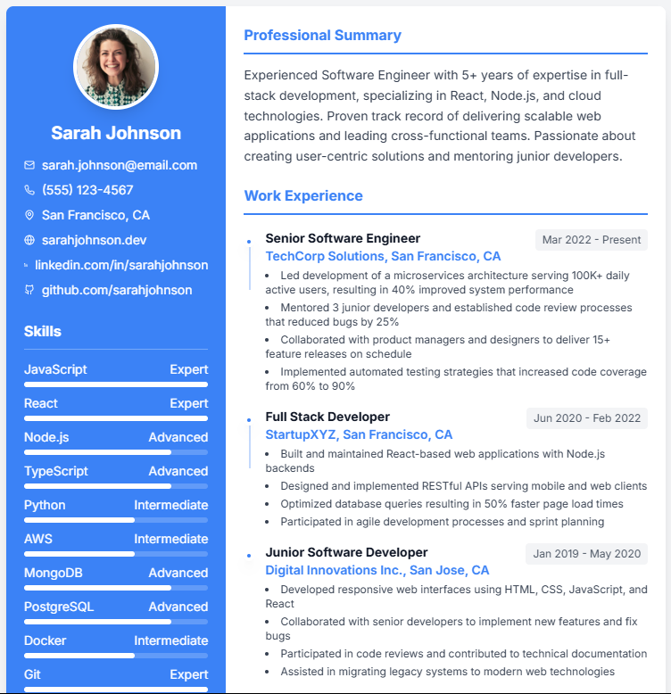

# TalentScript - Professional Resume Builder

[](https://talentscript.netlify.app)
[](LICENSE)
[](https://reactjs.org/)
[](https://www.typescriptlang.org/)

A modern, feature-rich resume builder that helps professionals create stunning resumes with ease. Built with React, TypeScript, and Tailwind CSS.

## 🌟 Features

### ✨ **Professional Templates**
- **Minimal Template**: Clean, ATS-friendly design perfect for traditional industries
- **Modern Template**: Contemporary layout with accent colors and visual elements
- **Creative Template**: Unique design with sidebar layout and profile image support

### 🎨 **Customization Options**
- **10+ Google Fonts**: Choose from carefully selected professional fonts
- **11 Accent Colors**: Customize your resume's color scheme
- **Profile Image Support**: Optional photo placement with privacy controls
- **Real-time Preview**: See changes instantly as you edit
- **Multi-Page Preview**: Accurate page-by-page representation with print boundaries

### 📝 **Comprehensive Content Management**
- **Personal Information**: Contact details, social links, and profile photo
- **Professional Summary**: Compelling overview of your experience
- **Work Experience**: Detailed job history with drag-and-drop reordering
- **Education**: Academic background with GPA and graduation dates
- **Skills**: Categorized by proficiency level (Beginner to Expert)
- **Certifications**: Professional credentials with expiration tracking
- **Projects**: Portfolio items with technology tags and links
- **References**: Professional contacts with relationship details

### 🔧 **Advanced Functionality**
- **Drag & Drop Reordering**: Organize experience and education entries
- **Smart PDF Generation**: Multi-page PDF export with proper page breaks
- **PDF Sharing**: Direct PDF sharing via native share API
- **Print Area Visualization**: Clear boundaries showing printable content
- **User Authentication**: Secure login with cloud data synchronization
- **Interactive Tutorial**: Guided onboarding for new users
- **Responsive Design**: Works perfectly on desktop and mobile
- **User Feedback System**: Integrated feedback collection via Netlify Forms

## 🔐 Authentication & Data Storage

- **🔑 Logged-in users**: Resume data is securely saved to your account in MongoDB Atlas. Access your resume from any device after logging in. Data automatically loads upon login and resets upon logout.
- **🖥️ Guests**: Resume data is saved locally in your browser. Do not use this on public/shared computers.

## 🛡️ Security

- Passwords are hashed and salted using bcrypt before being stored in the database.
- JWT is used for authentication with 7-day expiration.
- Client-side data validation and sanitization.

## 👁️ Privacy Notice

- If you are not logged in, your data is only stored locally and is not sent to any server.
- If you are logged in, your data is securely stored in the database and is not shared with third parties.
- Feedback submissions are processed through Netlify Forms with optional contact information.

## 🚀 Live Demo

**[Try TalentScript Now →](https://talentscript.netlify.app)**

## 📸 Screenshots

### Main Interface


### Template Showcase
| Minimal | Modern | Creative |
|---------|--------|----------|
|  |  |  |


## 🛠️ Technology Stack

### Frontend
- **React 18.3.1** - Modern UI library with hooks
- **TypeScript 5.5.3** - Type-safe JavaScript
- **Tailwind CSS 3.4.13** - Utility-first CSS framework
- **Vite 5.4.8** - Fast build tool and dev server

### UI Components
- **Radix UI** - Accessible, unstyled UI primitives
- **shadcn/ui** - Beautiful, customizable components
- **Lucide React** - Consistent icon library
- **Framer Motion** - Smooth animations (via Tailwind)

### PDF Generation & Sharing
- **html2canvas 1.4.1** - HTML to canvas conversion with multi-page support
- **jsPDF 2.5.1** - Client-side PDF generation with automatic page splitting
- **Web Share API** - Native PDF sharing capabilities

### Development Tools
- **ESLint** - Code linting and formatting
- **TypeScript ESLint** - TypeScript-specific linting rules
- **PostCSS** - CSS processing with Autoprefixer

## 🏗️ Project Structure

```
src/
├── components/
│   ├── resume-builder/
│   │   ├── form-sections/          # Individual form components
│   │   │   ├── PersonalInfoForm.tsx
│   │   │   ├── ExperienceForm.tsx
│   │   │   ├── EducationForm.tsx
│   │   │   ├── SkillsForm.tsx
│   │   │   ├── CertificationsForm.tsx
│   │   │   ├── ProjectsForm.tsx
│   │   │   ├── ReferencesForm.tsx
│   │   │   ├── SummaryForm.tsx
│   │   │   └── CustomizationForm.tsx
│   │   ├── templates/              # Resume templates
│   │   │   ├── MinimalTemplate.tsx
│   │   │   ├── ModernTemplate.tsx
│   │   │   └── CreativeTemplate.tsx
│   │   ├── Header.tsx              # App header with save/download
│   │   ├── ResumeBuilder.tsx       # Main container component
│   │   ├── ResumeForm.tsx          # Form tabs container
│   │   └── ResumePreview.tsx       # Live preview component
│   ├── tutorial/
│   │   └── TutorialModal.tsx       # Interactive tutorial
│   └── ui/                         # Reusable UI components (shadcn/ui)
├── contexts/
│   └── ResumeContext.tsx           # Global state management
├── hooks/
│   └── use-toast.ts                # Toast notification hook
├── lib/
│   └── utils.ts                    # Utility functions
├── types/
│   └── resume.ts                   # TypeScript type definitions
├── utils/
│   ├── fontLoader.ts               # Google Fonts integration
│   └── pdfGenerator.ts             # PDF export functionality
├── App.tsx                         # Root application component
├── main.tsx                        # Application entry point
└── index.css                       # Global styles and Tailwind imports
```

## 🚀 Getting Started

### Prerequisites
- **Node.js** 18.0 or higher
- **npm** 9.0 or higher

### Installation

1. **Clone the repository**
   ```bash
   git clone https://github.com/yourusername/talentscript.git
   cd talentscript
   ```

2. **Install dependencies**
   ```bash
   npm install
   ```

3. **Start the development server**
   ```bash
   npm run dev
   ```

4. **Open your browser**
   Navigate to `http://localhost:5173`

### Build for Production

```bash
# Build the application
npm run build

# Preview the production build
npm run preview
```

## 📖 Usage Guide

### Getting Started
1. **Launch the Application**: Open TalentScript in your browser
2. **Sign Up or Continue as Guest**: Create an account for cloud sync or use locally
3. **Complete the Tutorial**: Follow the interactive guide for new users
4. **Add Your Information**: Fill in your personal details, experience, and education
5. **Customize Your Design**: Choose a template, font, and color scheme
6. **Preview Your Resume**: View multi-page layout with print boundaries
7. **Save Your Progress**: Data saves automatically (locally or to cloud)
8. **Share or Download**: Export as PDF or share directly

### Data Management
- **Cloud Sync**: Logged-in users get cross-device synchronization
- **Local Storage**: Guest data saved in browser with privacy protection
- **Auto-Save**: Changes are automatically preserved
- **Smart Export**: Multi-page PDF generation with proper formatting
- **Direct Sharing**: Share PDF files via native device sharing

### Print Preview Features
- **Page Boundaries**: Visual indicators show printable areas
- **Multi-Page Layout**: Content automatically flows across pages
- **Print-Safe Formatting**: Prevents content from being cut mid-line

### Customization Options

#### Templates
- **Minimal**: Best for ATS systems and traditional industries
- **Modern**: Great for tech and creative roles
- **Creative**: Perfect for design and marketing positions

#### Fonts
Choose from 10 professional Google Fonts:
- Inter (default)
- Roboto
- Open Sans
- Lato
- Montserrat
- Source Sans Pro
- Raleway
- Poppins
- Playfair Display
- Merriweather

#### Colors
Select from 11 accent colors to match your personal brand or industry standards.

## 🔧 Configuration

### Environment Variables
No environment variables are required for basic functionality. The application runs entirely client-side.

### Customization
To modify templates or add new features:

1. **Templates**: Edit files in `src/components/resume-builder/templates/`
2. **Forms**: Modify components in `src/components/resume-builder/form-sections/`
3. **Styling**: Update Tailwind classes or `src/index.css`
4. **Types**: Add new data structures in `src/types/resume.ts`

## 🧪 Testing

### Manual Testing Checklist
- [ ] Form validation works correctly
- [ ] Drag and drop reordering functions
- [ ] PDF generation produces quality output
- [ ] Data persistence across browser sessions
- [ ] Responsive design on mobile devices
- [ ] Tutorial guides new users effectively

### Browser Compatibility
- ✅ Chrome 90+
- ✅ Firefox 88+
- ✅ Safari 14+
- ✅ Edge 90+

## 🚀 Deployment

### Netlify (Recommended)
The application is optimized for Netlify deployment with integrated services:

1. **Connect your repository** to Netlify
2. **Build settings**:
   - Build command: `npm run build`
   - Publish directory: `dist`
3. **Environment variables**: Configure MongoDB and JWT secrets
4. **Enable Netlify Forms**: Automatic form detection for feedback system
5. **Deploy**: Automatic deployment on git push

### Backend Deployment
- **MongoDB Atlas**: Cloud database hosting
- **Node.js Server**: Deploy to Heroku, Railway, or similar platforms
- **Environment Configuration**: Secure credential management

### Other Platforms
- **Vercel**: Works with additional configuration for forms
- **GitHub Pages**: Static hosting (limited backend functionality)
- **AWS S3**: Static hosting with CloudFront (requires separate backend)

## 🤝 Contributing

We welcome contributions! Please follow these steps:

1. **Fork the repository**
2. **Create a feature branch**: `git checkout -b feature/amazing-feature`
3. **Commit your changes**: `git commit -m 'Add amazing feature'`
4. **Push to the branch**: `git push origin feature/amazing-feature`
5. **Open a Pull Request**

### Development Guidelines
- Follow TypeScript best practices
- Use existing UI components when possible
- Maintain responsive design principles
- Add proper error handling
- Update documentation for new features

## 📝 License

This project is licensed under the MIT License - see the [LICENSE](LICENSE) file for details.

## 🙏 Acknowledgments

- **Radix UI** for accessible component primitives
- **shadcn/ui** for beautiful component designs
- **Tailwind CSS** for utility-first styling
- **Lucide** for consistent iconography
- **Google Fonts** for typography options

## 📞 Support

- **Documentation**: Check this README and inline code comments
- **Issues**: Report bugs via GitHub Issues
- **Discussions**: Use GitHub Discussions for questions

## 🗺️ Roadmap

### Upcoming Features
- [ ] Additional professional templates
- [ ] Cover letter builder integration
- [ ] LinkedIn profile import
- [ ] ATS optimization scoring
- [ ] Collaborative editing features
- [ ] Mobile app development
- [ ] Advanced analytics dashboard
- [ ] Custom branding options

### Version History
- **v1.3.0** - Multi-page preview, PDF sharing, user authentication, feedback system
- **v1.2.0** - Interactive tutorial, drag-and-drop reordering, enhanced privacy controls
- **v1.1.0** - Multiple templates, font customization, color themes
- **v1.0.0** - Initial release with core functionality

---

**Built with ❤️ by the TalentScript Team**

[Live Demo](https://talentscript.netlify.app) | [Report Bug](https://github.com/yourusername/talentscript/issues) | [Request Feature](https://github.com/yourusername/talentscript/issues)